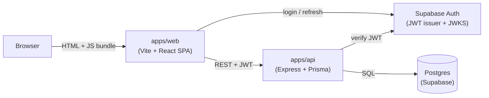
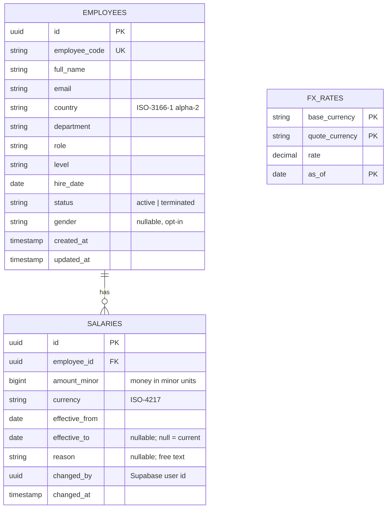
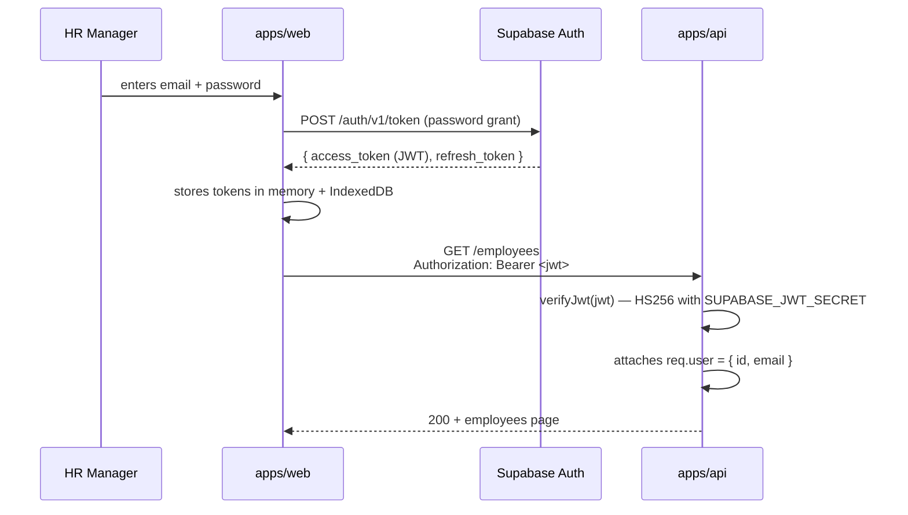
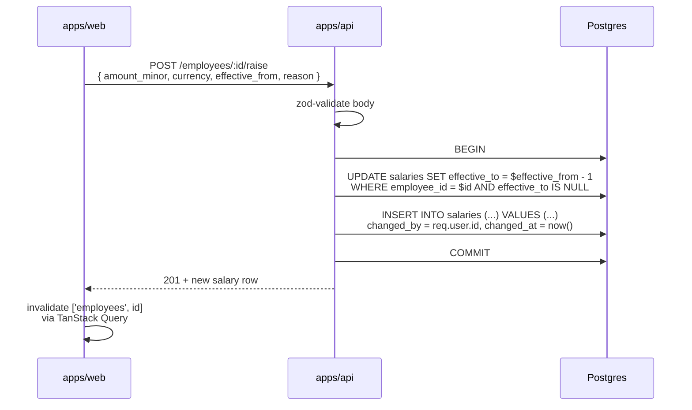

# Architecture

A short, diagram-led overview of the system. For decision histories, see [`docs/decisions/`](decisions/). For trade-offs that span multiple decisions, see [`TRADE-OFFS.md`](TRADE-OFFS.md). For scope, see [`REQUIREMENTS.md`](REQUIREMENTS.md).

## System shape



Three deployables:

| Component | Hosting (planned) | Role |
|---|---|---|
| `apps/web` | Vercel | Static SPA. Never holds secrets beyond the Supabase anon key. |
| `apps/api` | Render | Stateless Node service. Holds the database URL and the JWT secret. |
| Postgres | Supabase | Single source of truth for employees, salaries, and FX. |
| Supabase Auth | Supabase | Manages identity, issues JWTs. We never read the auth tables directly. |

The API is the only service with write access to the database. The SPA never talks to Postgres or Supabase Auth's admin surfaces — only to the API and to Supabase Auth's client-side login endpoints.

## Data model



Notes:

- **Salary history is immutable.** A raise inserts a new row and closes the previous row's `effective_to`. The pair runs in a single transaction. The "current" salary for an employee is the row where `effective_to IS NULL`.
- **Money is stored in minor units.** `amount_minor` is `bigint` (cents, paise, etc.) + `currency` is ISO-4217. The display layer converts to a chosen display currency via the FX snapshot. See ADR 0006 (lands in commit 6) for the why.
- **`changed_by` references the Supabase user id**, not a local users table — we don't mirror Supabase Auth's user table. See ADR 0004.
- **Indexes that matter for the query patterns** are documented alongside the Prisma schema in commit 5.

## Auth flow



The API trusts only the JWT signature; user identity comes from the verified payload. There is no session table on the API side.

## Give-raise flow



If either statement fails the transaction rolls back and no rows are written. The audit columns (`changed_by`, `changed_at`, `reason`) are populated by the API at the same time as the insert.

## Backend layering

```
apps/api/src/
  routes/        Thin. Mount the controller's handler onto an Express
                 Router. No logic.
  controllers/   Parse + validate input (zod), call services, shape
                 response, map known errors to HTTP status codes.
  services/      Business logic. Orchestrate repositories. Owns
                 transactional boundaries.
  repos/         Database access only. One file per aggregate. Returns
                 domain types, never raw Prisma rows.
  domain/        Pure functions. Money, FX, analytics aggregations.
                 Easy to unit-test. No I/O.
  config/        Env parsing (zod), Prisma client singleton, logger.
  middleware/    auth, error handling, request id.
```

Why the split:

- **Routes don't import Prisma** — that's a hard rule. If a route needs data, it calls a service.
- **Controllers convert between HTTP and domain** — a controller knows about `res.status(404)`; a service does not.
- **Services own transactions** — `prisma.$transaction(...)` lives in services, not repos, because a single transaction often spans multiple repositories (give-raise touches `salaries` twice; bulk import touches `employees` and `salaries`).
- **Repos return domain types** — the service layer should not have to know whether the row came from Prisma, raw SQL, or a mock. Repo functions take inputs, return outputs, no Prisma types leak out.
- **Domain is pure** — money math, percentile calculations, FX conversion. No `await`, no Prisma, no `req`. Easy to test, cheap to run.

This layering is documented as an ADR alongside the first endpoint that uses the full stack (commit 9).

## Request lifecycle

A representative GET request:

```
HTTP request
  → helmet (security headers)
  → cors
  → express.json
  → pino-http (logs req id, latency)
  → authMiddleware (verifies JWT, attaches req.user)
  → router → controller
      → controller validates input via zod
      → controller calls service
        → service composes repository calls
          → repo runs Prisma query
        → service returns domain object
      → controller maps to response shape
  → response sent
  → pino-http logs status + duration
```

Errors short-circuit through a final error-handling middleware that maps:

- `ZodError` → 400 with `{ error: 'invalid_input', issues: [...] }`
- `ApiError` (our own typed errors) → its declared status
- Anything else → 500 with `{ error: 'internal_error' }` and a logged stack trace

## Frontend shape

```
apps/web/src/
  main.tsx              QueryClientProvider + Router (when added)
  App.tsx               Top-level layout shell
  api/
    client.ts           fetch wrapper with base URL + ApiError
    employees.ts        per-resource query/mutation functions (lands in commit 14)
  components/
    ui/                 shadcn primitives (added per feature)
    <feature>/          feature-specific components
  pages/                route-level components (lands when router does)
  lib/
    money.ts            display formatting (uses Intl.NumberFormat)
    auth.ts             Supabase client + session hooks
```

TanStack Query is the source of truth for any data that comes from the API. Components read via `useQuery`, mutate via `useMutation`, and rely on invalidation rather than manual cache pokes.

## Testing seams

| Layer | Tool | What it covers |
|---|---|---|
| Domain (pure) | Vitest | Money, FX, analytics math, validators. Fast, no I/O. |
| Repositories | Vitest + a real Postgres test DB | Pagination, filters, transactions, raise semantics, bulk import rollback. |
| API routes | Vitest + supertest + real Postgres | Auth gating, validation errors, happy paths. End-to-end inside the API. |
| Frontend components | Vitest + Testing Library + jsdom | Components render expected output given props/queries. |
| Smoke E2E | Playwright | One happy path: login → filter → open employee → give raise. |

Integration tests use **a real Postgres**, not pg-mem or mocks. Prior experience: mocked DB tests pass while migrations or query semantics break in production. The cost of running Postgres locally (Docker or Supabase CLI) is small; the value of catching real query bugs is high.

## What this architecture deliberately doesn't do

- **No background jobs / queues.** Every operation is request-scoped. Bulk import runs inside the request lifecycle (chunked transactions, ~1k rows per chunk) and returns when done. If we needed to process millions of rows we'd add a queue.
- **No read replicas, no caching layer, no CQRS.** Postgres handles 10k rows for an HR app trivially.
- **No multi-tenancy.** One organization. Adding tenancy means a tenant-id column on every table and a tenant filter on every query — not retrofittable without a real plan.
- **No event sourcing of salary changes.** The append-only `salaries` table *is* the event log for compensation. Audit on the row, not on a separate stream.
- **No GraphQL.** REST + Zod gives us enough type-safety and is consumable by any client that speaks HTTP.

## Operational concerns (v1 baseline)

| Concern | v1 approach | Production upgrade path |
|---|---|---|
| Logs | `pino` JSON logs to stdout. Render captures stdout. | Ship to Datadog / Logflare. |
| Errors | Stack traces in logs; client gets generic `internal_error`. | Wire Sentry on both web and api. |
| Metrics | None. | Prometheus middleware on `/metrics`. |
| Backups | Supabase daily backups (default). | PITR + cross-region replication. |
| Secrets | `.env` files locally; Vercel/Render env vars in deploy. | Vault or cloud-native secret manager. |
| Rate limit | None on v1 (single-tenant, single user). | Per-IP and per-user limits at the edge. |

These omissions are deliberate and documented in [`TRADE-OFFS.md`](TRADE-OFFS.md).
